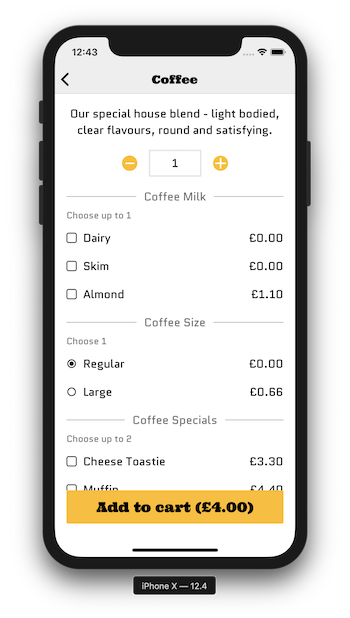
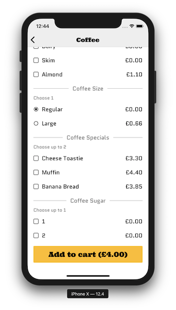

Included are some designs of the UI for an ordering system to be built. The screen shows a _single product_ from an ordering menu.

 

Looking at the screens and the written requirements below come up with a schema for an API endpoint that will return a _single product_, eg "Coffee" in the screens above.

Find a way to write this schema down to communicate to your team (choose any way you think suits).

**Requirements**

1. A product has a name, a cost (amount), and may have a description. In the screens **Coffee** is the product name.
2. A product may have options available. Examples in the screens are `Coffee Milk` and `Coffee Size`.
3. Each option for a product has 1 or more choices available, eg `Coffee Size` has 2 choices "Regular" and "Large".
4. An option may have a minimum defined, being the minimum number of choices a user must select for the option. `Coffee Size` has a minimum of 1 in the screens.
5. An option may have a maximum defined, being the maximum number of choices a user can select for the option. `Coffee Size` has a maximum of 1, and `Coffee Specials` has a maximum of 2.
6. A choice may be pre-selected (auto-selected). The "Regular" `Coffee Size` is pre-selected.
7. Choices may alter the price of the product, eg "Almond" `Coffee Milk` costs £1.10 extra.
8. Products, options and choices all have unique IDs.
